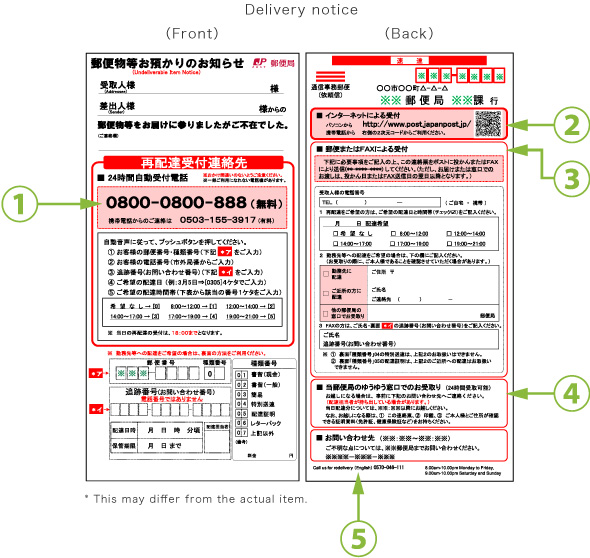

# 事務関連マニュアル
## 休日出勤について
前日の昼までに社長と相談のうえ、社長へ個別に申請します。

**休日出勤時のタイムカードの打刻漏れ**には特に注意してください。最悪、認められないケースも発生するので、貴重に対応をお願いします。

## 経費の計算について
主な摘要項目は次のとおりです。
1. 資料代
1. 通信費
4. 毛委託品費

|摘要  |内容  |値段 
|--|--|--
|資料代  |書箱 有料アプリ |200 100
|通信費  |切手 宅配便料金 |400 500
|託品費  |文具 台所用品 |300 250

## 宅配便の発送について
## 電話、来客対応について
## ゴミ収集について
## プリンタについて
## プリンタドライバーのインストール
ダウンロードページ (http://example.com/printer_driver)よりOSに合わせたドライバをダウンロードしてください。

macOSではシステム環境設定の「プリンタとスキャナ」を開き、「＋」ボタンをクリックしてプリンタを追加します。

## 大容量のデータの送受信について
